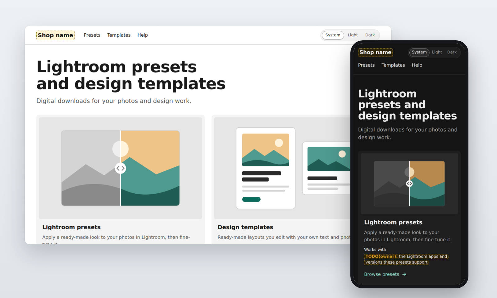
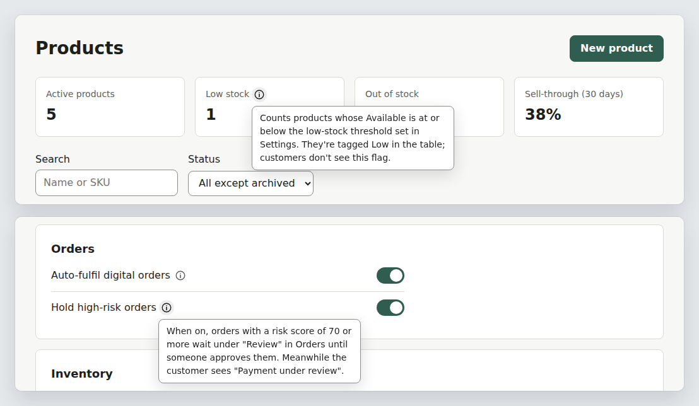

# Consistent Web UI

[](https://github.com/smileemir/consistent-web-ui/actions/workflows/tests.yml)
[](LICENSE)
[](https://agentskills.io)

**An Agent Skill that makes AI-built websites look like one product, not twenty prompts.**



*A new shop built from an empty folder: one theme source, light and dark themes, and yellow owner placeholders where real facts are still missing.*

AI coding assistants often design each page as if nobody had seen the others: three button styles, five greys, spacing picked at random, a dark mode that breaks half the site, invented "only 3 left!" badges. Consistent Web UI gives the assistant a method instead of a mood board:

- one theme source;
- shared roles for colour, spacing, type, layers and motion;
- reusable components with every state designed;
- real data only;
- verification on an actually rendered page.

It works in any assistant that supports the open Agent Skills format, and with any frontend stack.

## What it does

- **Audits existing sites before touching them.** It inventories every route template, theme source, token gap and inconsistency, then writes **one** Markdown report. You pick what to change, and it changes one approved page at a time.
- **Stays in its lane.** Frontend only. Backend, database, API, payment and permission changes need your separate approval. Existing buttons keep doing exactly what they did.
- **Builds new sites on one theme source.** It fills in a design contract with you and starts from a semantic token file with light/dark themes, a layer (z-index) scale and motion roles, or from your framework's own theme (Tailwind, shadcn/ui, Bootstrap, MUI, Shopify, WordPress and more).
- **Keeps the same job looking the same.** Buttons, inputs, dropdowns, cards, rows, dialogs, notices, icons, list toolbars (filter, sort, view, columns) and optional information cards share one grammar across pages. Controls in a row share one height, and dropdown lists, dialogs and toasts wear the brand, not the browser's defaults.
- **Gets layers right.** Only the top layer scrolls and responds. The page behind an open dialog stays still, clicks never pass through an overlay, and nothing see-through lets text mix.
- **Refuses to invent.** Prices, stock, delivery promises, reviews, metrics and urgency come from real data, or the section is not shown.
- **Explains only what needs explaining.** An info (i) appears only where an item's purpose or effect cannot be guessed. It says what the item does in one or two sentences, and never sits on every card. Labels, errors, empty states and confirmations follow one writing pattern.
- **Checks its own work.** It renders changed pages at phone, tablet and desktop widths, at 200% zoom, in every theme and the longest language, then walks the keyboard path and checks reduced motion and contrast. Anything it could not render is reported as unverified, never as passed.
- **Balances motion.** Every click, tap and toggle gets brief feedback, and nothing moves on its own except real progress and one chosen moment. Animations are one-shot, respect reduced-motion settings and follow a written record.
- **Saves tokens.**
  - Scripts do the scanning, so the assistant does not open every file.
  - Small fixes skip the full audit.
  - Sector guidance is split so a task loads only what it needs.

## See it work



*Info (i) help added to a store admin. It appears only on items new staff could not work out, and the text comes from the project's own staff guide. Both examples come from the evaluation tasks, which use fictional projects ([evals/](evals/)).*

The method works for any website or web app; it was also tested on the settings page of a SaaS app. Sector packs add detailed page and component guidance on top. The first sector pack is **ecommerce**. It covers:

- 20 customer routes and 12 admin screens;
- 22 card roles;
- asset families, responsive rules and 12 transaction traces;
- 49 motion records;
- five original direction briefs.

Marketplace and SaaS come next ([ROADMAP.md](ROADMAP.md)).

## Install

**Claude Code, as a plugin:**

```text
/plugin marketplace add smileemir/consistent-web-ui
/plugin install consistent-web-ui@consistent-web-ui
```

**Any assistant with a skills folder:** copy the `consistent-web-ui/` folder into it.

```bash
git clone --depth 1 https://github.com/smileemir/consistent-web-ui.git

# Claude Code, all projects
mkdir -p ~/.claude/skills && cp -R consistent-web-ui/consistent-web-ui ~/.claude/skills/

# OpenAI Codex, all projects
mkdir -p ~/.agents/skills && cp -R consistent-web-ui/consistent-web-ui ~/.agents/skills/
```

The skills folders:

| Assistant | Personal (all projects) | One project |
| --- | --- | --- |
| Claude Code | `~/.claude/skills/consistent-web-ui/` | `.claude/skills/consistent-web-ui/` |
| OpenAI Codex | `~/.agents/skills/consistent-web-ui/` | `.agents/skills/consistent-web-ui/` |
| Other Agent Skills-compatible tools | see the tool's docs for its skills folder | |

**Apps that accept uploaded skills:** download the zip from the [latest release](https://github.com/smileemir/consistent-web-ui/releases/latest).

The two scripts need only Python 3.8 or newer, and nothing else.

## Try it

- "Audit every page of my store's frontend and give me one report. Don't change anything until I choose."
- "The add-to-cart button on the product page doesn't match the rest of the site. Fix just that."
- "Design a new shop for downloadable software with light and dark themes, real checkout states and a consistent look on phones."
- "Make the order list in the admin use the same filter, sort and column toolbar as the product list."

## Tools you can also run yourself

```bash
# Read-only inventory: routes, theme sources, token gaps, value spread, motion signals
python3 consistent-web-ui/scripts/frontend_index.py --root path/to/frontend

# WCAG contrast for every theme in a CSS file (pairs guessed from token names)
python3 consistent-web-ui/scripts/contrast_check.py --css app/globals.css --pairs auto --only-failures
```

`scripts/ui_check.js` runs inside a rendered page (paste it into the browser console, or load it with Playwright) and measures rows of controls and open overlays.

## What's inside

```text
consistent-web-ui/
  SKILL.md                      the method: lanes, rules, verification
  LICENSE.txt                   MIT license (travels with the folder)
  scripts/                      frontend_index.py, contrast_check.py, ui_check.js (runs in the page)
  assets/templates/             audit report, design contract, theme tokens, contrast pairs,
                                page spec, motion record, asset register, info (i) component,
                                form controls, dialog, toast
  references/                   design contract, framework mapping, audit and QA,
                                help and UI text, overlays and controls, motion core, ecommerce pages,
                                components, assets, responsive rules, transaction
                                traces, motion records, five direction blueprints,
                                sector program
evals/                          test prompts, fixtures and results for the skill
tests/                          tests for the scripts, templates and package
```

## Honest status

- **Checked:**
  - The skill passes the official Agent Skills validation.
  - 48 automated tests pass (scripts, templates and packaging) on Python 3.8 to 3.14.
  - The scripts were run against real open-source storefront, theme and component-library code.
  - Eight realistic evaluation tasks run on fictional projects: seven stores and one SaaS app ([evals/](evals/)). In the comparison round, v0.5 passed 49 of 50 checks and v0.4 passed 42, on the five tasks that were re-run. Each task ran once, so a one-check difference is noise ([results](evals/results/)).
- **Written guidance, not measurements:**
  - The ecommerce guidance is original design work.
  - Motion durations are starting hypotheses to test on real devices, not timings measured from other sites.
  - The five direction briefs are proposals, not finished websites.
- **Not yet proven:** The ecommerce sector still needs its end-to-end validation on a real project.

## Contributing

Ideas, bug reports and new sectors are welcome. Read [CONTRIBUTING.md](CONTRIBUTING.md) first; the [changelog](CHANGELOG.md) lists what changed in each version.

## License

[MIT](LICENSE)
